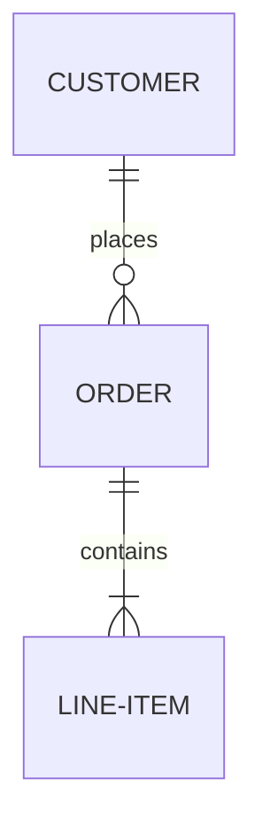

# Markdown Viewer

A cross-platform Electron-based markdown viewer for Mac, Windows, and Linux.

## Features

- Clean, distraction-free markdown viewing
- Mermaid diagram support (ERD, flowcharts, sequence diagrams, etc.)
- Syntax highlighting for code blocks
- GitHub Flavored Markdown support
- File browser with folder navigation
- Document outline navigation
- Recent documents list
- Live file watching (auto-reload on changes)
- Dark/light mode toggle
- Adjustable font size
- A4/full-width view modes
- PDF export
- File association with .md files
- Cross-platform support (macOS, Windows, Linux)

## Installation

### From Source

1. Clone this repository
2. Install dependencies:
   ```bash
   npm install
   ```

3. Run the app:
   ```bash
   npm start
   ```

## Building

Build for all platforms:
```bash
npm run build
```

Build for specific platforms:
```bash
npm run build:mac    # macOS
npm run build:win    # Windows
npm run build:linux  # Linux
```

## Usage

### Opening Files

- Click "Open File" button in the app
- Drag and drop a .md file onto the app window
- Double-click a .md file (after setting file associations)
- Right-click a .md file and choose "Open with Markdown Viewer"

### Keyboard Shortcuts

- `Cmd/Ctrl + O` - Open file
- `Cmd/Ctrl + Shift + O` - Open folder
- `Cmd/Ctrl + B` - Toggle sidebar
- `Cmd/Ctrl + R` - Reload current file

### Mermaid Diagrams

Mermaid diagrams are rendered automatically. Use fenced code blocks with the `mermaid` language identifier:

````markdown

````

Supported diagram types include flowcharts, sequence diagrams, ERD, class diagrams, state diagrams, and more.

### Setting as Default Application

#### macOS
1. Right-click any .md file
2. Select "Get Info"
3. Under "Open with:", select "Markdown Viewer"
4. Click "Change All..." to set for all .md files

#### Windows
1. Right-click any .md file
2. Select "Open with" > "Choose another app"
3. Select "Markdown Viewer"
4. Check "Always use this app to open .md files"

#### Linux
1. Right-click any .md file
2. Select "Properties" or "Open With"
3. Choose "Markdown Viewer" as the default application

## License

MIT
